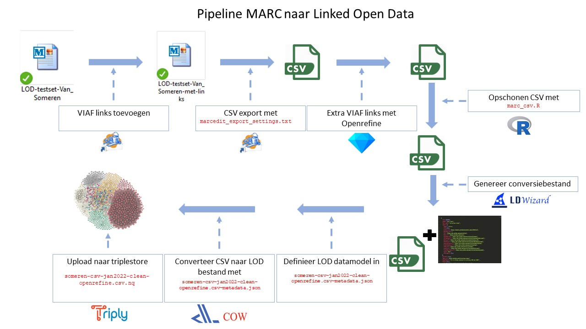

```{r setup, include=FALSE}
knitr::opts_chunk$set(echo = FALSE)
library(radix)
setwd("C:\\Users\\Schal107\\Documents\\UBU\\Team DH\\Linked Data experiments")


```
# Inhoudsopgave
1. [Inleiding](#inleiding)
2. [Pipeline](#pipeline)
3. [MarcEdit](#marcedit)
4. [De CSV-route](#de-csv-route)
5. [Extra links met Openrefine](#extra-links-met-openrefine)
6. [CSV naar LOD](#csv-naar-lod)
7. [Mogelijkheden](#mogelijkheden)
8. [Uitkomsten experiment en aanbevelingen](#uitkomsten-experiment-en-aanbevelingen)


## 1. Inleiding

In dit experiment proberen we een selectie van de catalogus - 50 pamfletten uit - om te zetten naar Linked Open Data en extra koppelingen toe te voegen. We beginnen bij het programma [MarcEdit](https://marcedit.reeset.net/) en een MARC bestand, zonder externe identifiers. De benodigde bestanden zijn allemaal beschikbaar in [Github repository RubenSchalk/marctolod](https://github.com/RubenSchalk/marctolod).

## 2. Pipeline

De belangrijkste stappen van het experiment staan in de volgende secties beschreven. De volledige pipeline staat alvast hieronder afgebeeld, samen met de corresponderende bestanden die voor elke stap nodig zijn (in <span style="color:red">rood</span>).




## 3. MarcEdit

In MarcEdit kunnen we het MARC bestand verrijken met externe identifiers zoals VIAF (Virtual International Authority File) en FAST. Op deze manier zijn via Linked Data de pamfletten te koppelen aan andere gegevens. In dit geval in hebben we ons gericht op persoonsnamen, maar het kan ook voor onderwerp, plaatsnamen, type werk, etc.

Deze verrijking gaat in MarcEdit als volgt:   

```
1. Open het bestand in Marc Editor 
2. Kies: Tools > Linked Data Tools > Build Linked Records > Process 
3. Na het klikken op “Process” werden in de velden die konden worden gematcht URI’s toegevoegd.  
```

Het bestand mét URI’s (links) is opgeslagen als [LOD-testset-Van_Someren-met-links.mrk](https://solisservices.sharepoint.com/:u:/r/sites/LinkedDatabijMA2/Shared%20Documents/General/Test%20Van%20MarcEdit%20tot%20LOD/LOD-testset-Van_Someren-met-links.mrk?csf=1&web=1&e=kb8j22). In een volgende fase is het eventueel mogelijk om naast het oorspronkelijke configuratie-bestand één of meerdere andere xml-bestanden aan te maken met afwijkende instellingen, zoals meer externe identifiers.

**Update 28-01-2022:** Omdat MarcEdit al koppelt met VIAF en de Nederlandse Thesaurus van Auteursnamen (NTA) is de meerwaarde van het her-configureren van het xml-bestand vermoedelijk beperkt. Andere routes, zoals standaardiseren van metadata en Openrefine, werkt mogelijk efficienter.


## (MarcEdit XML naar RDF)
<details>
  <summary>*Deze stap is achterhaald, maar klik op het pijltje om alsnog te lezen.*</summary>
Om van dit .mrk bestand naar LOD te komen, moeten er een paar conversiestappen plaatsvinden. Als eerst moet het bestand geconverteerd worden naar een `.mrc` bestand. Dit kan eenvoudig in MarcEdit. Vervolgens kan het .mrc bestand geconverteerd worden naar een MarcXML bestand, zodat de waarden in de metadata velden (zoals \$a, \$1 etc.) ingelezen kunnen worden. Ook dit kan via Marcedit > Tools.

Nu kan het XMl bestand omgezet worden naar [RDF](https://www.w3.org/RDF/): de standaard voor Linked Open Data. Deze stap is technisch en inhoudelijk het meest uitdagend. Wat feitelijk moet gebeuren is dat we moeten specificeren op welke manier de [MARC21 nummers](https://www.loc.gov/marc/bibliographic/) moeten worden gedefinieerd in het Linked Datamodel van keuze. Bijvoorbeeld, nummer 100 in MARC21 verwijst naar de naam van de auteur en kan worden gemodelleerd als `dc:creator`, volgens het veel gebruikte Europeana Data Model (EDM). Zie [hier](https://uba.uva.nl/binaries/content/assets/subsites/bibliotheek/open-data/uva-edm-rdf-open-data.pdf) voor een mapping tussen MARC en EDM, gemaakt door de UvA.

Een manier om deze 'mapping' te automatiseren - want je wilt niet een heel MARC21 handmatig gaan overtypen... - is door het gebruik van een conversiebestand als referentiekader. Omdat we met XML werken, kan dat met zogenaamde [XSL stylesheets](https://www.w3.org/Style/XSL/WhatIsXSL.html). Deze bestanden geven 'regels' voor het omvormen van het XML bestand. Het Library of Congress biedt reeds een XSL bestand aan waarin MARC21 omgezet wordt naar Dublin Core RDF: zie [hier](http://www.loc.gov/standards/marcxml/xslt/MARC21slim2RDFDC.xsl). Om met dit bestand te werken moet ook het bestand [MARC21slimUtils.xls](http://www.loc.gov/standards/marcxml/xslt/MARC21slimUtils.xsl) worden gedownload. 

Vervolgens kan via de command line de conversie naar RDF gedaan worden, met het aanroepen van een zogenaamde `xslt processor`. Als je in Linux/IoS werkt kun je die als volgt installeren: `sudo apt-get install -y xsltproc`. In Windows kan dat met een [Java tool](http://saxon.sourceforge.net/). 

In de command line ga je naar de directory van je bestanden (XML en twee maal XSL) en typ je dit: `xsltproc MARC21slim2RDFDC.xsl LOD-testset-Van_Someren-met-links.xml | cat > someren_testset.rdf`. Nu vind je in de directory `someren_testset.rdf`. En dat is je [LOD bestand](https://raw.githubusercontent.com/RubenSchalk/marctolod/main/someren_testset.rdf).

In Windows: `java net.sf.saxon.Transform -o:test.rdf testXML.xml MARC21slim2RDFDC.xsl` (nog niet geprobeerd).

Helaas zijn we er nu nog niet, want het standaard XSL bestand is nog niet goed gedefinieerd. De externe identifiers worden nog niet juist omgezet, vermoedelijk omdat dit een vrij recente (en experimentele) toevoeging is aan MarcEdit. Zoals je kunt zien in het RDF bestand zijn er nergens URI's aangemaakt maar enkel strings die niet verwijzen naar de externe identifiers waar we juist in geintereseerd zijn. 

Bijvoorbeeld hebben we nu een `dc:creator` die er zo uit ziet:

`<dc:creator>GregoriusXIV,paus,1535-1591.http://viaf.org/viaf/295180128</dc:creator>`

Dit betekent dat de XSL conversie opdracht geeft om ALLE elementen van MARC21 veld 100 achter elkaar te plakken. Hier wil je uiteindelijk aparte triples van maken zoals:

`GregoriusXIV schema:Date  1535-1591 ` <br> 
`GregoriusXIV owl:sameAs  http://viaf.org/viaf/295180128`

Pas dan kun je de mogelijkheden van Linked Data echt gaan benutten.

Met dank aan [deze presentatie](https://digitalcommons.osgoode.yorku.ca/cgi/viewcontent.cgi?article=1018&context=librarians) voor hulp bij de XSL stap.

**Update 17-12-2021: de 'xml-route' heeft enkele beperkingen t.o.v. de 'csv-route'. Daarom gaan we met de laatste verder.**
</details>

## 4. De CSV-route

De XML route lijkt meer bewerkelijk dan via csv. We kiezen er daarom voor om de conversie via `csv` te doen: MarcEdit > csv > RDF. Ook hier moet er (deels) manueel werk gedaan worden aan het conversiebestand, maar via standaard 'regels' is dit hopelijk grotendeels te automatiseren *zolang de metadata goed genoeg is*. De 'regels' zullen hopelijk per metadataveld uniform te formuleren zijn. Het bijwerken van het conversiebestand (zie onder) hoeft dan enkel sporadisch te gebeuren als er nieuwe metadatavelden aan de LOD collectie worden toegevoegd.

### CSV export en opschoning
Eerst moeten we via MarcEdit ons verrijkte bestand exporteren naar `.csv`. Dit betekent dat alle $a etc. velden plus inhoud samengevoegd worden met het nummer (bijv. 100), zodat je één observatie per variabele overhoudt (100\$a = Temple, William,  100\$d = 1628-1699 etc.). In MarcEdit kun je specificeren welke MARC velden je naar een csv wilt exporteren (`Tools > Export > Export Tab Delimited Format`). Hierbij hoef je niet alle MARC velden elke keer handmatig in te vullen, want dit kan opgegeven worden door een `.txt` bestand te selecteren bij `Next > Settings`. Voordeel van de csv-conversie is dat er geen data verloren gaat: wanneer er meerdere waarden in een MARC veld staan worden die allemaal in hetzelfde csv veld geplaatst en gescheiden met een opgegeven scheidingsteken. 

Vanuit MarcEdit is met een [`marcedit_export_settings.txt`](https://raw.githubusercontent.com/RubenSchalk/marctolod/main/marcedit_export_settings.txt) een aantal velden omgezet naar `csv`. Naast velden over de titel, auteur en plaats,zijn ook de links meegenomen, zodat we deze kunnen converteren naar LOD (het is eenvoudig om aan dit tekstbestand meer velden toe te voegen).

**update 21-01-2022:** In veel MARC velden staan meerdere namen, die in de csv vervolgens in hetzelfde veld terecht komen. Bijvoorbeeld `Verdousius, Cornelius.Rodia, Gerarda`. Deze moeten gescheiden worden om er aparte links van te kunnen maken. Omdat het, zeker wanneer we gaan opschalen, om veel MARC velden gaat en een onbekend aantal waarden per veld, is het aan te raden dit niet handmatig te doen. We specificeren daarom eerst in MarcEdit een scheidingsteken dat niet in de strings zelf voorkomt (bijvoorbeeld `%`) om deze waarden te kunnen identificeren. Vervolgens gebruiken we een kort R-script om de waarden te scheiden in aparte kolommen, per MARC veld: [`marc_csv.R`](https://raw.githubusercontent.com/RubenSchalk/marctolod/main/marc_csv.R).

De MARC velden zijn als volgt gescheiden om enkele waarden per cel over te houden: 600\$a_1 = de eerste naam, 600$a _2 = de tweede, etc. De links zijn als volgt aan de namen te herleiden: 600\$1_1 is de VIAF link van de naam in kolom 600\$a_1 , 600\$1_2 de VIAF link van kolom 600\$a_2, etc. De eerste 1 verwijst naar VIAF (XXX\$0 is LC en/of FAST, vandaar het onderscheid).

**update 28-01-2022:** De opschoning in het bestand `marc_csv.R` is uitgebreid om ervoor te zorgen dat de conversietool COW niet breekt over 1) variabelen die beginnen met nummers, 2) verkeerde encoding en 3) lege velden met spaties. Daarnaast worden de Worldcat en Worldcat UU links alvast in het R script gegenereerd. Dit omdat in COW Jinja templating niet mogelijk is op datatype `xsd:anyURI` (m.a.w. COW kan geen URLs aanmaken a.d.h.v. [joins](https://jinja.palletsprojects.com/en/2.11.x/templates/#join)). Dit alles is doorgevoerd in het script. Alle variabelen beginnen nu met `marc_` en de encoding is `UTF-8`.

## 5. Extra links met Openrefine

**Update 21-01-2022:** Met MarcEdit is eerder ongeveer de helft van de naamsvelden verrijkt met een externe link. Met Openrefine proberen we dit percentage te verhogen. Openrefine biedt een 'reconciliation' optie, wat betekent dat waarden gematched worden tegen een te specificeren API. Hierbij kunnen ook anderen MARC velden als context worden meegenomen. Indien er een match is, kan de link naar deze match worden toegevoegd aan de dataset (onze csv). Voor nu kiezen we het VIAF als service. Omdat deze links universeel gebruikt worden in catalogi, kunnen we via deze link in de toekomst 'doorklikken' naar relevante data over het item buiten onze catalogus. 

De specifieke stappen die in Openrefine moeten worden gedaan staan beschreven in [`openrefine_steps_someren_jan2022.txt`](https://raw.githubusercontent.com/RubenSchalk/marctolod/main/openrefine_steps_someren_jan2022.txt). 

Om de Openrefine links te kunnen onderscheiden van de eerdere MarcEdit links, is ‘extralinks’ aan de variabele naam toegevoegd. Dus, de openrefine links van 700\$a_2 zijn te vinden onder kolom 700\$1_2_extralinks. De links die er al waren staan in kolom 700\$1_2 (als die er waren, in dit geval niet).

Er zijn 17 nieuwe VIAF links aan het bestand toegevoegd, wat het totaal brengt op 62. De Openrefine stap voegt dus ongeveer 35% toe. 

Ook is onderzocht of de oude ALEPH records additionele links kunnen opleveren, maar dit wordt als te arbeidsintensief beoordeeld om op te schalen. Er wordt ca. 10% extra links gevonden, maar het ophalen van de back-up kost veel tijd en het nalopen van de records ook.

### Controle van de nieuwe VIAF links
*Nog toevoegen*


## 6. CSV naar LOD

De meest toegankelijke manier om van de opgeschoonde en verrijkte `csv` LOD te maken is via [LDwizard](https://ldwizard.netwerkdigitaalerfgoed.nl/): een website met simpele interface die de stap van csv naar LOD ondersteunt - en bovendien het conversiebestand direct beschikbaar stelt. Daarnaast is in LDwizard per variabele - hier: MARC veld - te selecteren welk vocabulary je wilt gebruiken als beschrijving, zoals `schema.org`. Helaas biedt LDwizard niet alle functionaliteiten die we willen. Bijvoorbeeld, sommige gegevens zoals titel en jaar van uitgave wil je koppelen aan het pamflet, maar andere, zoals geboortedatum en VIAF-link van de auteur, aan de auteur. Dit kan (nog) niet met LDwizard, omdat het enkel een 'plat' datamodel ondersteunt. Ook is het niet mogelijk om 'klikbare' links naar bijvoorbeeld VIAF te specificeren. we moeten daarom het conversiebestand dat LDwizard genereert (een `json` bestand), nog handmatig aanpassen aan onze wensen.  

**Update 17-12-2021:** hoewel de 'proof of concept' van MARC naar LOD is gelukt, hebben we (nog) geen 'klikbare' links in onze Linked Open Data. Deels komt dit omdat de metadata nog niet voldoende is verrijkt in MarcEdit, deels omdat er van de wel verrijkte velden nog geen URI's zijn aangemaakt in de LOD. Een voorwaarde om op grote schaal en semi-automatisch deze links aan te maken is zoveel mogelijk de metadata te standaardiseren. We moeten onderzoeken hoe dit het beste kan, want je wilt niet alle auteursnamen handmatig gaan controleren. 

**Update 21-01-2021:** Om de metadata te verrijken is de Openrefine stap toegevoegd, zoals beschreven in de [Openrefine sectie](#extra-links-met-openrefine). Nu dit is gedaan kan de stap CSV naar LOD, plus het verbeteren van het conversiebestand, gedaan worden.

**Update 28-01-2022:** Voor nu is het CSV bestand omgezet naar LOD met zoveel mogelijk gebruik van het [datamodel van de UvA](https://uba.uva.nl/binaries/content/assets/subsites/bibliotheek/open-data/uva-edm-rdf-open-data.pdf), dat grotendeels overeenkomt met het Europeana Data Model. Variabelen die hier niet in staan zijn zoveel mogelijk gemapped volgens gebruikelijke standaarden en vocabularies (vooral Dublic Core en Simple Event Model). In het conversiebestand [someren-csv-jan2022-clean-openrefine.csv-metadata](https://raw.githubusercontent.com/RubenSchalk/marctolod/main/someren-csv-jan2022-clean-openrefine.csv-metadata.json) is dit per variabele na te gaan. Dit is later eenvoudig aan te passen naar wens.

In het algemeen komt het erop neer dat je voor elk MARC veld (elke variabele in de csv), specificeert welke triples je daarvan wilt aanmaken. 

Het onderstaande blok in het conversiebestand leidt tot onderstaande triple:

```
{
     "virtual": true,               # om aan te geven dat we triple 'bedenken' 
     "name": "marc_oclc_no",        # naam van de variabele die we gebruiken als object
     "aboutUrl": "https://data.universiteitsbibliotheekutrecht/someren/id/{marc_oclc_no}", # subject
     "propertyUrl": "dc:date",      # predicate
     "datatype": "string",          # datatype (string, cijfer (integer/double/float), URL, datum, of URI)
     "csvw:value": "{marc_260_c_1}" # object
   }
```
Triple:

`<https://data.universiteitsbibliotheekutrecht/someren/id/66866546> <http://purl.org/dc/terms/title> "Raben Nest, auss wölchem bey jetziger Herbst Mess..."^^<http://www.w3.org/2001/XMLSchema#string>`

Wat betekent: pamflet nr. 66866546 heeft als titel "Raben Nest etc."

Op deze manier is per variabele te specificeren welke relaties deze in de Linked Data graaf moeten hebben. Vaak zijn dat er meer dan één. Ook kan het subject (het derde element in de triple), weer optreden als object voor een andere relatie, bijvoorbeeld:


```
subject          predicate         object
pamflet nummer > heeft auteur    > auteursnaam. 
auteursnaam    > heeft VIAF LINK > VIAF URL
```

Het mooie hiervan is dat je informatie specifiek aan een deel van de metadata kunt toewijzen: sommige informatie gaat over de auteur, andere over het pamflet. Zo kun je bijvoorbeeld de geboorteplaats scheiden van de plaats van publicatie, zelfs als deze gelijk zijn. Daar kan vervolgens specifiek op gezocht worden door gebruikers. 

## 7. Mogelijkheden

De SPARQL query [`image.rq`](https://druid.datalegend.net/RubenS/-/queries/images/5) laat goed zien wat de mogelijkheden van LOD zijn. Hier worden van de auteurs automatisch de geboortedatum en een afbeelding toegevoegd aan het zoekresultaat. Dit kan omdat de VIAF link is opgenomen in Wikidata (de gegevens achter Wikipedia). Via de VIAF link die we hebben toegevoegd aan onze metadata is nu dus **alle** informatie van deze auteur in Wikidata op te vragen - evenals alle data waarnaar verwezen wordt. De koppeling gaat automatisch via deze identifier en kost ons slechts enkele regels in de query!

Ook alle andere uitgaande en inkomende links, bijvoorbeeld van andere bibliotheken en museau, zijn (op termijn) via deze koppelingen te raadplegen. Wikidata, en steeds meer grote LOD databases zoals DBpedia, fungeren zo als 'hub' om informatie en metadata met elkaar te verbinden - zelfs zonder dat je als gebruiker van tevoren hoeft te weten waarmee je precies wilt verbinden. Op die manier kun je niet alleen je zoekvraag enorm specificeren of juist contextualiseren, maar ook collecties vinden die verwant zijn aan waar je in geinteresseerd bent. Bijvoorbeeld omdat ze van een auteur zijn waarmee de auteur uit je zoekvraag mee heeft samengewerkt, of omdat het onderwerp of genre hetzelfde is (of allebei). 

Verder kun je de metadata en alle LOD koppelingen nu zien als één grote dataset (LOD cloud) die je kunt bevragen en analyseren zoals onderzoeksdata. Dat is niet alleen voor letterkundigen interessant, maar ook om beter systematisch te kunnen zoeken en bijvoorbeeld literatuur aan datasets te kunnen koppelen.Ook komt het de zoekbaarheid en vindbaarheid van collecties ten goede, omdat de data beter gevonden en bevraagd kunnen worden.

## 8. Uitkomsten experiment en aanbevelingen

### Uitkomsten

Het experiment is geslaagd omdat het gelukt is van 50 pamfletten Linked Open Data te maken. Alle geselecteerde metadata is vanuit MARC omgezet naar Linked Open Data, daarbij gebruik makend van veel gebruikte vocabularies. Hierdoor zijn de pamfletten op een extra manier ontsloten, beter vindbaar en bevraagbaar, en te koppelen aan andere datasets en collecties. Tevens wordt de koppeling met onze Worldcat Discovery omgeving behouden, waardoor de provenance gewaarborgd is. Er is vanuit LOD altijd terug te 'klikken' naar het oorspronkelijke pamflet in Worldcat. 

Om de vindbaarheid en verbondenheid verder te bespoedigen zijn er VIAF links toegevoegd. Via MarcEdit en Openrefine zijn in totaal 62 VIAF links toegevoegd (auteur en onderwerp) aan 31 pamfletten. Het bleek mogelijk om 27 hiervan automatisch te koppelen aan Wikidata en zo van 20 auteurs automatisch een afbeelding en geboortedatum op te halen. 

### Aanbevelingen

Hoewel de pipeline uit meerdere stappen bestaat is de omzetting van MARC naar LOD technisch niet heel complex. Het grootste obstakel is de kwaliteit van de metadata. Verschillende systemen hebben ertoe geleid dat sommige metadata van mindere kwaliteit is dan andere en onvoldoende is gethesaureerd. In dat geval is het lastig om VIAF of andere links toe te voegen, waarmee de mogelijkheden van Linked Data niet optimaal benut worden. Koppeling met externe data is geen vereiste, maar maakt het veel makkelijker om gevonden te worden, links te maken met andere collecties en de metadata te contextualiseren. Het grootste knelpunt ligt daarom op het vlak van de metadata, met name standaardisering en entity management.  

<u>Suggesties</u>:

- Goede metadata is essentieel om goede LOD te maken;
    -   nadenken over manieren om automatisch metadata te verbeteren; 
    -   de KB heeft dit bijvoorbeeld geautomatiseerd door [clusters te maken van werken die qua spelling erg op elkaar      lijken](https://lab.kb.nl/tool/rda-entity-finder) en deze allemaal te koppelen aan een gestandaardiseerd werk.
- UBU Linked Data omgeving (Triply?) om verder te experimenteren en de resultaten toegankelijk te maken voor collega's.
- VIAF links gebruiken als validatie (is hopelijk wat OCLC ook deels gaat aanbieden).
- Pipeline opzetten voor automatisch verrijken van metadata met andere data, zoals Wikidata.

<u>Eventueel</u>:

  - Kennis binnen UB borgen/uitbreiden?
  - Alternatieve pipelines van MARC > LOD onderzoeken?


## Colofon

Universiteitsbibliotheek Utrecht, afdeling M&A

Vragen en suggesties: <r.schalk@uu.nl> 


